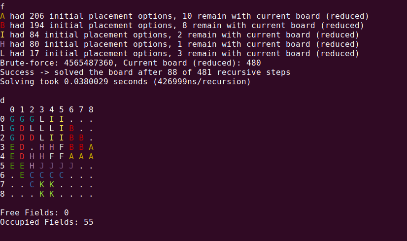
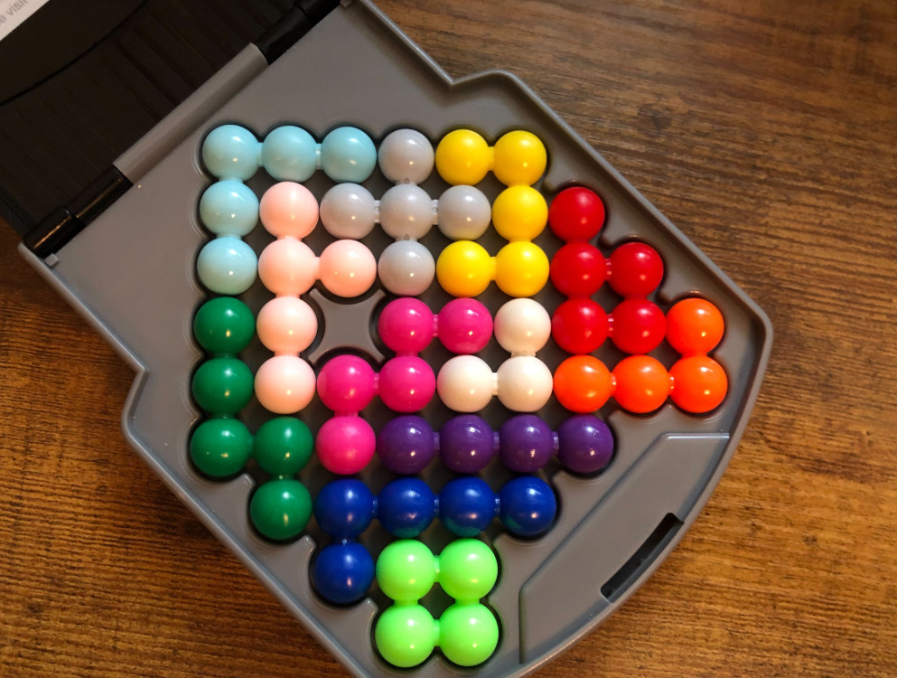

# ball_game
This is an interactive solver for the Lonpos Puzzle Game.

Use the following commands to create a given board state, draw it on the console and solve for the missing piecs.

> Place a piece: `p <pieceId>  <orientation>  <x>  <y>`

> Remove a piece: `x <pieceId>`

> Draw the board: `d`

> Find a solution: `f`

# Pieces

Each piece has an identifier from *A* to *L*. 

Depending on its shape, a piece can have a number of different orientations it can be placed (e.g. A has 8 possible orientations, J has 2, K has 1). 

> Show all pieces: `s`

> Show possible orientations for a piece: `s <pieceId>`

# Example

Starting the program shows the following output.

The following commands create the state from the first image.

Pressing `f` finds a valid placement for all remaining pieces.

Voilá: 

