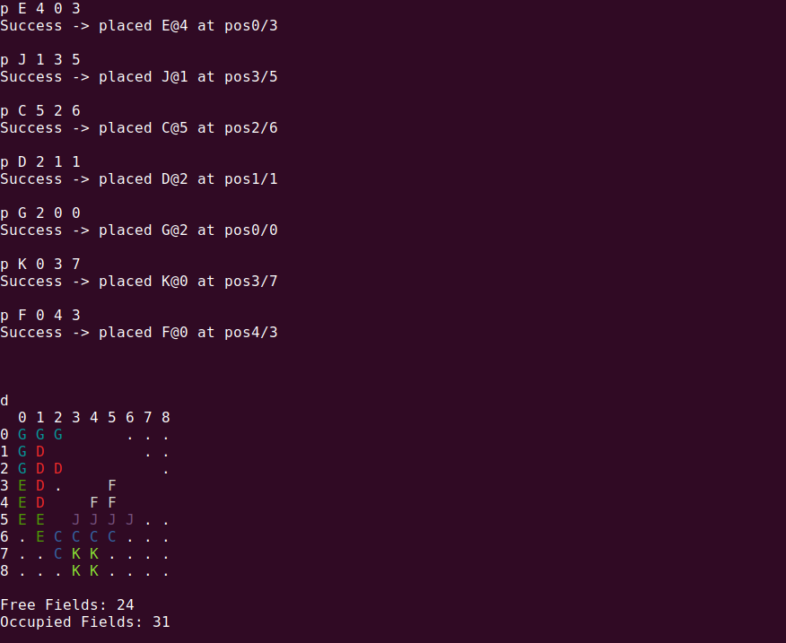

# ball_game
This is an interactive solver for the Lonpos Puzzle Game.

Launching the program will show all available commands. For example, type `d` to draw the current (initially empty) board state. Unaccessible fields are drawn as `.` and other fields can either be free (showing nothing) or occupied by a certain piece (showing the piece identifier). 

# Pieces

Each piece has an identifier, which is a capital letter between *A* and *L*. 

Depending on its shape, a piece can have a certain number of different orientations for placing it on the board. For example, piece A has 8 possible orientations, J has 2, K has 1. The `s` command can be used to print the shape and orientation of pieces. 

> Show shape and state of all pieces: `s`

> Show shape, state and orientations of a piece: `s <pieceId>`

# Placing Pieces

The following commands create the state from the first image.

The syntax for placing a piece is:

> `p <pieceId> <orientationId> <x> <y>`

where x and y specify the upper-left coordinate of the piece's bounding box. The piece is only placed if the given placement is valid. If the desired position is partly occupied for example, the board remains unaffected.

# Find a Solution

The `f` command finds a valid placement for all yet unplaced pieces.

Voilá 🎉 

